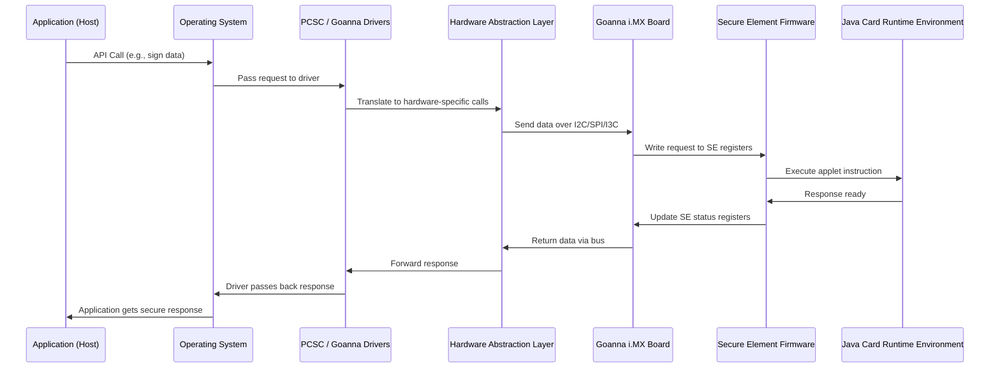

# **Secure Element (SE) Detailed Technical Terminology**

---

## **1. Introduction**

A **Secure Element (SE)** is a **tamper-resistant hardware component** designed to securely store sensitive data (e.g., cryptographic keys, credentials, payment tokens) and perform cryptographic operations.
It ensures **confidentiality**, **integrity**, and **authentication** while protecting against physical and logical attacks.

---

## **2. SE Architecture Overview**

A Secure Element can exist in different form factors:

* **Embedded SE (eSE)** → Integrated into the SoC or processor
* **SIM-based SE (UICC / eSIM)** → Inside SIM cards
* **Discrete SE** → External secure chip (connected via SPI/I²C/I³C)

Internally, an SE consists of:

* **CPU Core** → Executes Java Card Runtime Environment (JCRE)
* **ROM** → Stores immutable firmware & boot code
* **EEPROM / Flash** → Stores keys, certificates, and secure applets
* **RAM** → Temporary workspace for cryptographic operations
* **Crypto Co-processors** → Hardware accelerators for AES, RSA, ECC, SHA, etc.
* **Register Banks** → Hardware registers for GPIO control, interrupts, data transfer
* **Java Card OS** → Lightweight OS running JCRE

---

## **3. Components in the Communication Chain**

### **3.1. Host System**

* Runs the **application** that wants to communicate with the SE.
* Uses APIs, frameworks, and libraries to interface with the SE.
* Example: `pcsc-lite` for Linux or `winscard` for Windows.

### **3.2. Device Drivers**

* Drivers like **PC/SC**, **libccid**, or custom Goanna IMX drivers are installed.
* These drivers:

  * Provide high-level APIs to applications.
  * Translate user-space commands into **low-level protocol frames**.
  * Use buses like **I²C**, **SPI**, or **I³C** to communicate.

### **3.3. HAL (Hardware Abstraction Layer)**

* Sits between OS and driver.
* Translates generic OS calls into **driver-specific** implementations.
* Ensures the OS does not need to know hardware details.

### **3.4. Goanna i.MX Board**

* Acts as the **bridge** between the Host and SE.
* Contains:

  * SoC / Microcontroller
  * Peripheral interfaces (I²C, SPI, I³C)
  * GPIO registers
  * Firmware that manages SE communications.

### **3.5. Secure Element Firmware**

* Runs **inside the SE**.
* Understands protocol frames sent by the Goanna board.
* Exposes internal APIs for **APDU processing** (Application Protocol Data Units).
* Executes cryptographic and secure operations.

### **3.6. Java Card Runtime Environment (JCRE)**

* Runs inside the SE.
* Executes Java Card applets securely.
* Manages memory, access control, cryptographic APIs, and secure transactions.

---

## **4. Communication Flow**

### **Step-by-Step Data Flow**

1. **Application Layer (Host System)**

   * Application requests a secure operation.
   * Example: Generate RSA key, sign data, verify a token.
   * Uses APIs exposed by **PCSC / driver libraries**.

2. **OS & Subsystem**

   * OS routes the request to the proper driver via **syscalls**.
   * Uses `/dev/pcsc` or similar device endpoints.

3. **Driver Layer**

   * PCSC/Goanna driver converts API calls into low-level **I²C / SPI / I³C** frames.
   * Writes data into **Goanna board registers**.
   * Example: `i2c_smbus_write_block_data()`.

4. **Goanna Board Firmware**

   * Parses the driver request.
   * Forwards it to the SE via the configured bus.
   * Manages **interrupts**, **register updates**, and **GPIO signaling**.

5. **Secure Element (SE)**

   * Firmware inside SE receives the request.
   * Passes data to **JCRE**.
   * Executes secure applet instructions.
   * Stores or retrieves sensitive data from secure flash.

6. **Response Path**

   * JCRE → SE Firmware → Goanna Firmware → Driver → OS → Application.

---

## **5. Bus Protocols Used**

| **Protocol** | **Type**                     | **Usage**             | **Speed**       | **Where Used**   |
| ------------ | ---------------------------- | --------------------- | --------------- | ---------------- |
| **I²C**      | Serial                       | Control + small data  | 100 kHz – 1 MHz | Goanna ↔ SE      |
| **SPI**      | Serial                       | High-speed bulk data  | Up to 50 MHz    | Goanna ↔ SE      |
| **I³C**      | Serial                       | Advanced, low-power   | Up to 33 Mbps   | Next-gen SE comm |
| **PCIe**     | Parallel / High-speed serial | SE in integrated SoCs | GB/s range      | Host ↔ Goanna    |

---

## **6. Register Usage**

* **Registers** are small memory locations inside **hardware controllers**.
* Used for:

  * Writing commands to SE.
  * Reading responses from SE.
  * Handling interrupts and GPIO control.
* Example:

  * Driver writes `0x1F` into **control register**.
  * Goanna firmware interprets `0x1F` → instructs SE to start crypto op.
  * SE updates **status register** when operation is complete.

---

## **7. Java Card & APDU Commands**

Inside the SE, communication happens using **APDU (Application Protocol Data Unit)** commands.

* **Command APDU** → Sent from host → SE.
* **Response APDU** → Sent from SE → host.

Example:

```
00 A4 04 00 07 A0 00 00 00 03 00 00
```

* **00** → CLA (Class)
* **A4** → INS (Instruction)
* **04 00** → P1 P2 (Parameters)
* **07** → Lc (Length)
* **A0 00 00 00 03 00 00** → Data (Applet AID)

---

## **8. Mermaid Diagram**



---

## **9. Security Guarantees**

* Data never leaves SE in plain format.
* Host & Goanna firmware cannot access raw crypto keys.
* Communication between SE and host can be encrypted (SCP02 / SCP03).

---

## **10. Summary**

* Drivers like **PCSC** act as translators between the application and SE.
* Goanna board + drivers manage protocol-level communication.
* SE firmware + JCRE execute secure operations.
* Hardware registers + buses handle **low-level signaling**.
* APDU commands are used to talk to SE securely.

---

